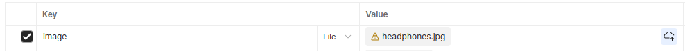

## Launching the project
After cloning the project run `./gradlew bootRun` in the command line or use your IDE

## Available API endpoints
There are four test products available in database after the application start
* Get list of products `GET` `api/products`
* Get product by id `GET` `api/products/{id}` where `id` is an id of a product
  ```
  {
    "id": 2,
    "name": "Смартфон Galaxy",
    "brand": "Samsung",
    "model": "Galaxy S20",
    "availableAmount": 50,
    "weight": "0.2 kg",
    "rating": 4.8,
    "category": "Электроника",
    "description": "Мощный смартфон Samsung Galaxy S20",
    "color": "Синий",
    "price": 899.99,
    "images": [],
    "features": [
        "Два слота для SIM"
    ]
  }
  ```
* Get product with the best rating `GET` `api/products/best-rated`
* Get the cheapest product `GET` `api/products/cheapest`
* Get the most expensive product `GET` `api/products/most-expensive`
* Add product `POST` `api/products` with a JSON of a product in the request body
  ```
  {
    "name": "Смартфон Galaxy",
    "brand": "Samsung",
    "model": "Galaxy S20",
    "availableAmount": 50,
    "weight": "0.2 kg",
    "rating": 4.8,
    "category": "Электроника",
    "description": "Мощный смартфон Samsung Galaxy S20",
    "color": "Синий",
    "price": 899.99,
    "images": [],
    "features": [
        "Два слота для SIM"
    ]
  }
  ```
* Delete product `DELETE` `api/products/{id}` where `id` is an id of a product to be deleted
* Update product `PUT` `api/products/{id}` with a JSON of a product in the request body where `id` is an id of a product to be updated
* Add image to a product with removing the background `POST` `api/products/{id}/uploadImage` where `id` is an id of a product\
    * To upload an image via Postman set `key` name to `image`, choose type `File` and choose an image you want to upload\
      
    * After uploading an image it will be saved to appropriate field of a product. To see the image use `GET` request, copy the url of an image and open it in a browser\
    * It is possible to add several images to one product\
    * Source images are stored in resources/pictures
